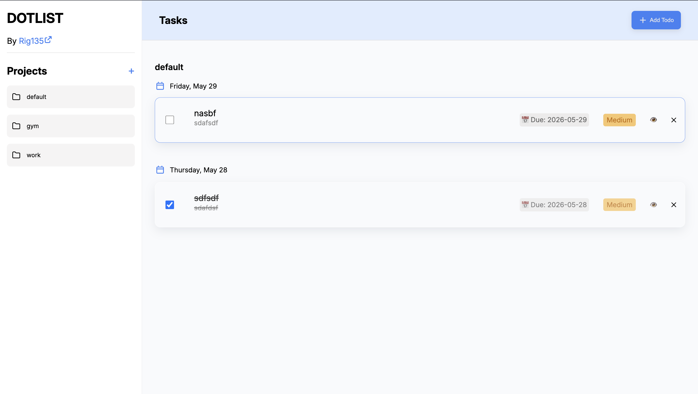
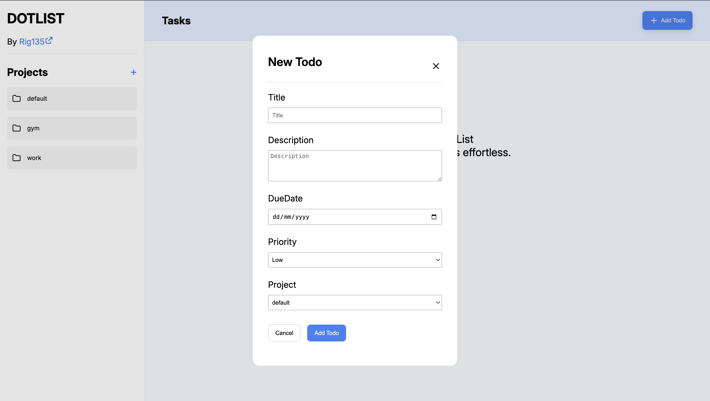
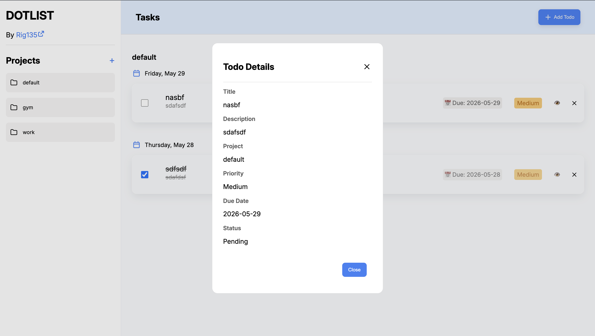

# dotList

A simple todo app built with vanilla JavaScript. You can create projects, add todos inside them, and everything stays saved even after refresh.

---

## Features

- Create and delete projects
- Add todos to specific projects
- Mark todos as completed
- View todo details in a dialog
- Delete todos with confirmation
- Data is saved using localStorage

---

## Screenshots

- Main UI
  

- Add Todo
  

- View Todo
  

---

## How it works

All data is stored in a single object:

```js
const Project = {
  default: [],
  gym: [],
  work: [],
};
```

Each project has its own array of todos.

When something changes (add/delete/toggle), the whole object is saved to localStorage.

On page load:

- Data is read from localStorage
- Todos are recreated using the `List` class
- UI is rendered again

---

## Project structure

```
src/
  addProjects.js
  addTodos.js
  renderProjects.js
  renderTodo.js
  storage.js
  List.js
  index.js
```

---

## Tech used

- HTML
- CSS
- JavaScript (modules)
- Webpack (for bundling)

---

## Notes

- This app doesn’t use any framework
- Everything (state + UI) is handled manually
- localStorage is used for persistence

---

## Future improvements (towards production quality)

- **Better data structure**
  Move from object-based projects to a scalable structure (array of project objects with unique IDs). This makes renaming, deletion, and future features easier.

- **State management cleanup**
  Separate state logic from DOM logic more clearly (possibly introduce a simple store pattern).

- **Edit functionality**
  Allow editing of todos and project names instead of only creating/deleting.

- **Improved persistence**
  Reduce frequent writes to localStorage and handle data versioning for future changes.

- **More efficient rendering**
  Avoid full re-renders (`innerHTML = ""`) and update only affected elements.

- **Accessibility improvements**
  Better keyboard navigation, focus handling in dialogs, and semantic HTML.

- **Responsive UI polish**
  Improve layout on smaller screens and fix overflow issues on zoom.

---

## Author

Harshit Saraswat
GitHub: [https://github.com/Rig135](https://github.com/Rig135)
